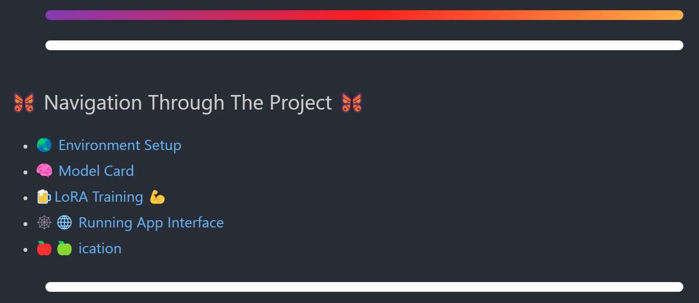

# 🌌 Caelus: AI Guidance from the Sky

> _"Caelus" – Latin for sky – symbolizes the vast opportunities above us, and the freedom to choose the right path in life._

---



<p align="center"><i>The navigation panel to access Caelus’ features</i></p>

---

## 🎯 Purpose

Caelus is an intelligent AI-powered web app that helps **high schoolers, students, and anyone seeking direction** make better life and career decisions — responsibly and ethically.

This is more than just an app — it's a **framework** for running high-performance small language models on older hardware, giving near large-model capabilities without the computational cost.

> 🚀 Built to run on a GTX 1650 Mobile with 4GB VRAM — a GPU that predates the AI boom.

---

## 🔬 Core Projects Inside

1. **🧠 A Scalable Small LLM Framework**

   - Implements a **novel technique** to enhance small models like **Qwen1.5 0.6B, 1.7B, and 4B**
   - **Bypasses token limitations**, drastically improving reasoning and usability
   - Extremely **lightweight**, with performance scaling based on device capacity

2. **📚 Caelus: The App**
   - Built on this framework
   - Helps users explore potential careers, reflect on decisions, and gain insight using conversational AI
   - Modular and easy to integrate into any pipeline or product

---

## ⚙️ Tech Stack

- 🐍 Python (Core)
- 📓 Jupyter Notebook (for rapid development)
- 🌐 Launches as a lightweight web app
- ⚡️ Compatible with low-VRAM GPUs like GTX 1650 Mobile

---


<p align="center"><i>Caelus in action — the AI assistant helping users reflect and explore</i></p>

---

## ✨ Features

- ⚖️ **Runs on legacy hardware** — designed for max compatibility
- 🪶 **Ultra-lightweight** — no need for giant GPUs or clusters
- 🧩 **Modular** — plug-and-play architecture
- 🛡️ **Fault-tolerant and safe** — does not respond to harmful queries (e.g., racism, violence)
- 🤖 **Multiple Qwen models supported** — choose between speed and reasoning depth
- 🌍 **Human-centric** — built to _support, not replace_ critical thinking

---

## 📺 Demo Video

[🎥 Watch the demo](static/app_demo.mp4)


---

## 🔐 License

This project is submitted for the **GRAILS Competition (Netherlands)**.  
However, **all copyright and intellectual property remain with the creator**.

> If you’re unsure about licensing but want people to use it freely while protecting yourself legally, the **MIT License** is a good fit. I can add this automatically if you want.

---

## 🛠️ Installation & Usage

```bash
# Clone the repository
git clone https://github.com/Aliph-Null/AI_Assistant_Grails-Competition
cd caelus

# (Optional) Create a virtual environment
python -m venv venv
source venv/bin/activate  # or .\venv\Scripts\activate on Windows

# Install dependencies
pip install -r requirements.txt

# Launch the notebook app.ipynb
```

## 🙌 A Final Word

Caelus aims to bring advanced AI to the hands of those who need it most — not just the few with cutting-edge machines.

Let’s redefine what "entry-level" hardware is capable of. 🌠

## 🔐 License

This project is licensed under the **MIT License** — see the [LICENSE](./LICENSE) file for details.

> This work is also part of the **GRAILS Competition (Netherlands)**, but all rights and IP are retained by the creator.
